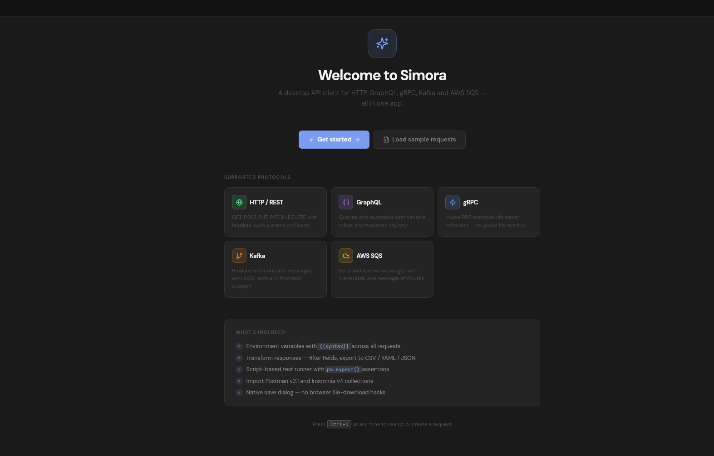
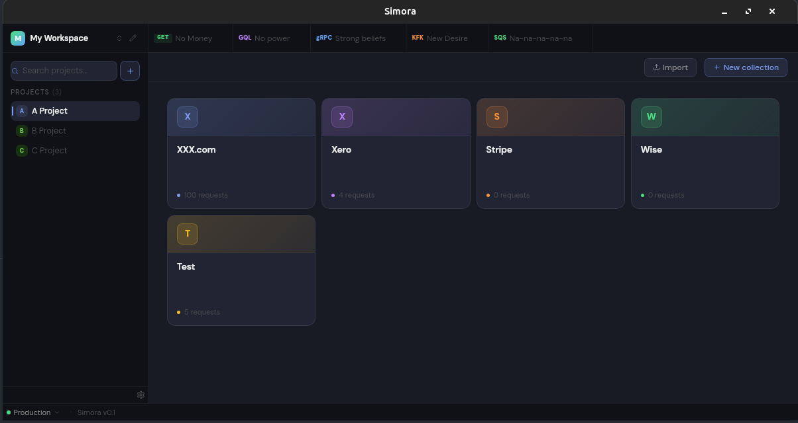
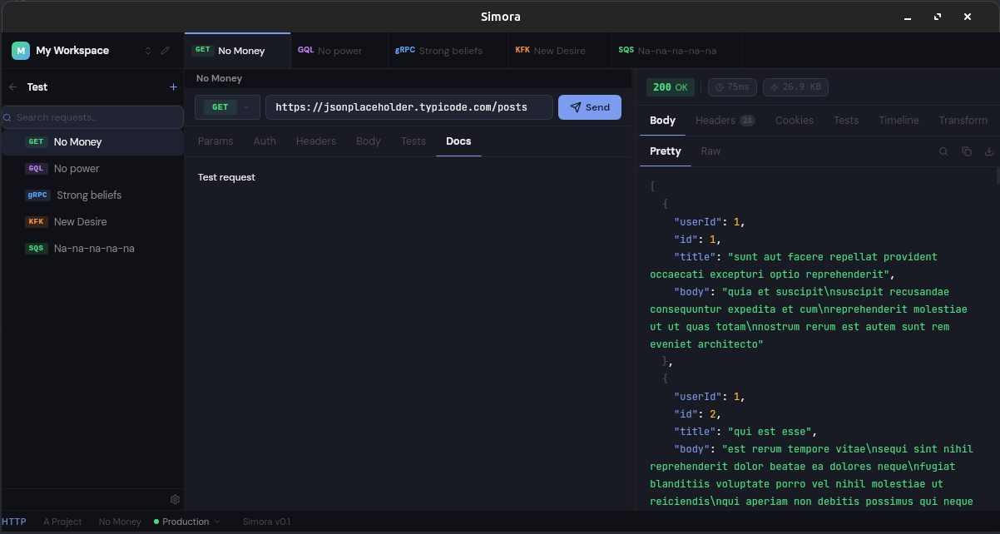
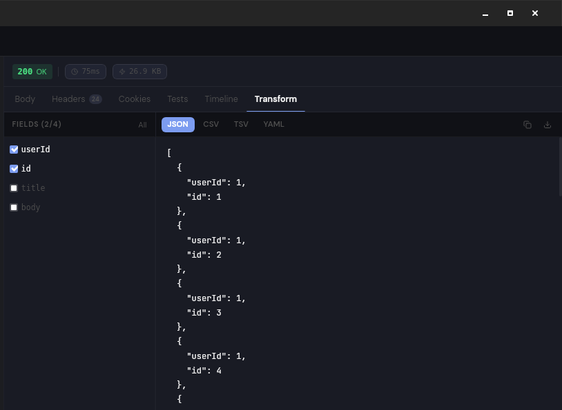
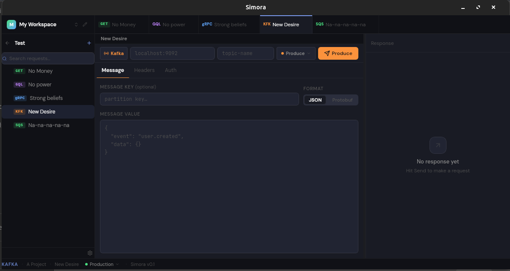
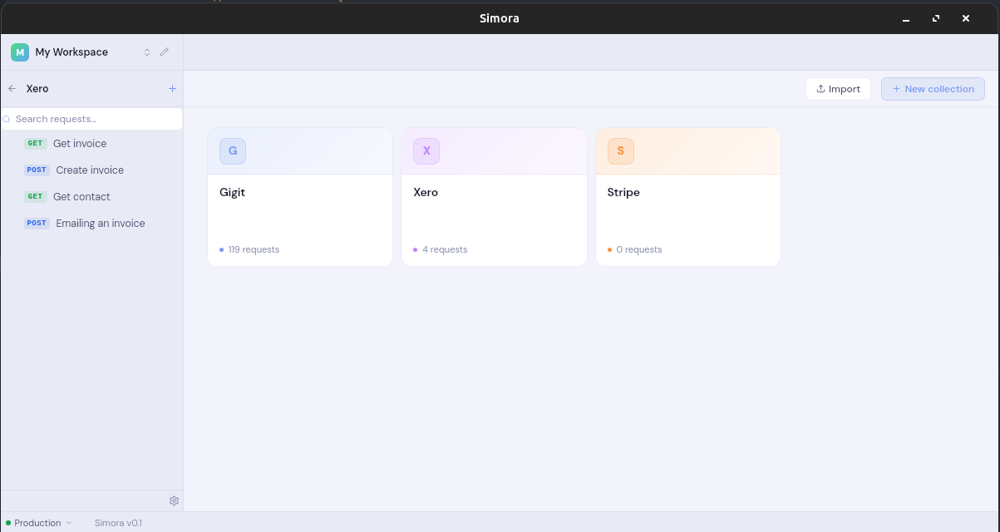
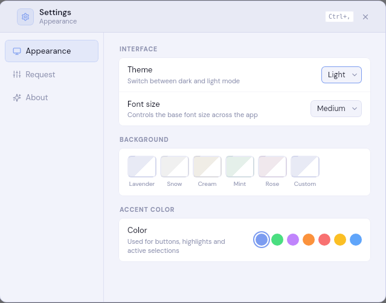

# Simora

A lightweight, native desktop API client built with Go and React. Think of it as a focused alternative to Postman or Insomnia — without the Electron overhead.

Supports HTTP, gRPC, Kafka, and SQS from a single interface, with a clean dark/light UI, environment variables, import from Postman/Insomnia collections, and a built-in test runner.





---

## Screenshots







---

## Features

- **HTTP** — all methods, query params, headers, body (JSON/form/binary), auth (Bearer, Basic, API Key, OAuth2)
- **gRPC** — server reflection, method discovery, request/response
- **Kafka** — produce and consume messages (JSON, Avro, plain text)
- **SQS** — send and receive messages
- **Collections** — organize requests in workspaces → projects → collections → folders
- **Environments** — variable substitution with `{{variable}}` syntax
- **Import** — Postman v2.1 and Insomnia v4/v5 (JSON and YAML)
- **Test runner** — write JS assertions per-request, run automatically after each send
- **Themes** — dark and light, 5 background presets each, custom color picker, accent color

---

## Tech Stack

| Layer     | Tech                                                      |
| --------- | --------------------------------------------------------- |
| Desktop   | [Wails v2](https://wails.io/) (Go + WebView, no Electron) |
| Backend   | Go 1.22                                                   |
| Frontend  | React 18 + TypeScript + Vite                              |
| Styling   | Tailwind CSS v4                                           |
| State     | Zustand                                                   |
| Transport | `IBM/sarama` (Kafka), `google.golang.org/grpc`, AWS SQS   |

---

## Getting Started

**Prerequisites:** [Go 1.22+](https://go.dev/dl/), [Node.js 20+](https://nodejs.org/), [Wails CLI](https://wails.io/docs/gettingstarted/installation)

> **Linux only:** `sudo apt install libgtk-3-dev libwebkit2gtk-4.0-dev`

```bash
# Install Wails CLI
go install github.com/wailsapp/wails/v2/cmd/wails@latest

# Clone and run
git clone https://github.com/BeautifuLie/simora.git
cd simora
make deps      # install frontend deps
wails dev      # start in development mode
```

### Build

```bash
make build
# Output: build/bin/simora (Linux), build/bin/simora.app (macOS), build/bin/simora.exe (Windows)
```

### Install (Linux)

To launch Simora from the terminal by typing `simora`:

```bash
make install   # builds and copies to /usr/local/bin/simora
```

On **macOS**, drag `build/bin/simora.app` to `/Applications`.
On **Windows**, run the generated `.exe` directly or add its folder to `PATH`.

### Tests

```bash
# Go backend
go test -race ./...

# Frontend
cd frontend && npm test
```

### Lint

```bash
make all  # runs lint + format check + tests
```

---

## Project Structure

```
simora/
├── backend/
│   ├── domain/        # core types (Organization, Project, Collection, Request…)
│   ├── service/       # business logic (OrganizationService, RequestService, SettingsService)
│   ├── storage/       # JSON file persistence (~/.simora/)
│   ├── transport/     # Kafka, SQS, gRPC adapters
│   └── mocks/         # gomock-generated mocks for tests
├── frontend/
│   └── src/
│       ├── app/       # root App component
│       ├── components/
│       │   ├── layout/   # Sidebar, TabBar, CommandPalette, Settings…
│       │   ├── request/  # RequestPanel and protocol-specific panels
│       │   ├── response/ # ResponsePanel, syntax highlighting
│       │   └── ui/       # primitives (Button, Badge, Resizable…)
│       ├── lib/       # utilities, import parsers, bg presets
│       └── store/     # Zustand store + all types
├── main.go
├── wails.json
└── Makefile
```

---

## Contributing

PRs and issues are welcome. See [CONTRIBUTING.md](./CONTRIBUTING.md) for setup instructions, branch conventions, and PR requirements.

---

## License

MIT — see [LICENSE](./LICENSE)
